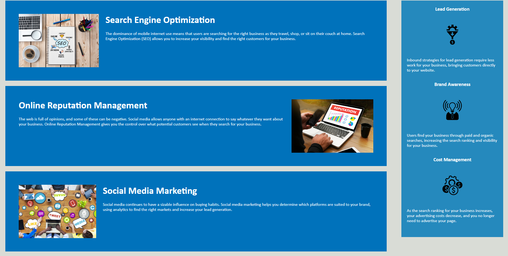

# Horiseon Landing Page Code Refactor

## Description

This is the Horiseon landing page with the HTML and CSS code refactored. The aim was to achieve better search engine optimization, accessibility and code readability without altering the appearance of the page. This was accomplished by replacing non-semantic HTML elements with appropriate semantic versions, rearranging the code to better reflect the structure of the page and adding appropriate comments.

## Installation

N/A

## Usage

The page can be accessed through the following link:

https://guilhfreitas.github.io/wk1coderefactorchallenge/

The HTML, CSS and asset files can be downloaded from the Repo.

## Credits

N/A

## License

Please refer to the LICENSE in the Repo.